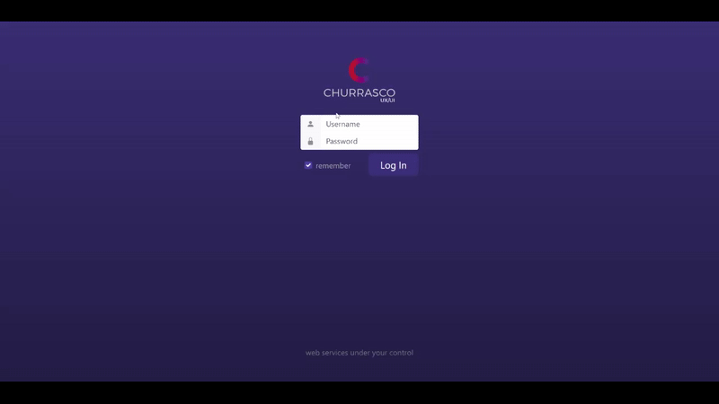
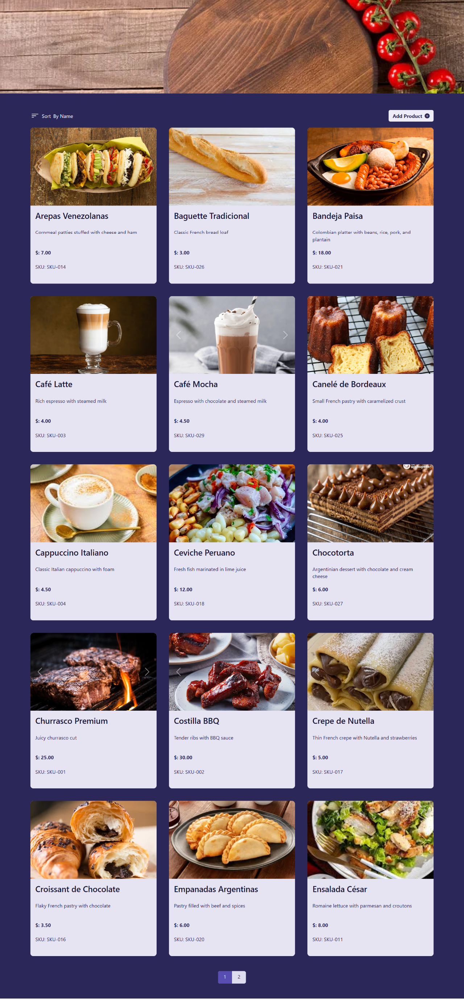
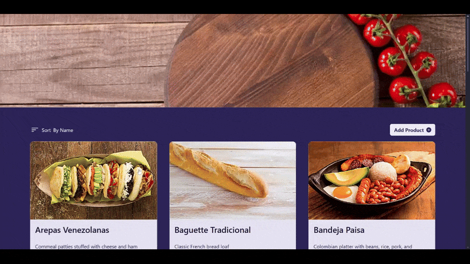

# 🛍️ Product List – SPA Challenge

A single-page application (SPA) built with Knockout.js, Sammy.js, and Bootstrap as part of a coding challenge. Users can log in, view a product list, and add new products.

---

## 🌍 Overview

ProductList was developed as part of a job interview challenge, achieving second place in the final results. The goal was to design a functional SPA with authentication, product listing, and product creation features.

Routing is handled by Sammy.js, data binding by Knockout.js, and styling by Bootstrap with custom CSS.

---

## ✨ Features

- 👤 Login system with token-based authentication
- 📦 Product listing for authenticated users
- ➕ Product creation form with validation
- 🔀 Routing handled by Sammy.js (`#/products`, `#/create`)
- 🎨 Responsive UI with Bootstrap + custom CSS
- ⚡ Lightweight and modular SPA architecture

---

## 📸 Showcase

### 🔑 Login



### 🛍 Products




### 🛒 Add Product


---

## 🛠 Tech Stack

- **Framework:** Knockout.js
- **Routing:** Sammy.js
- **Styling:** Bootstrap + CSS
- **Helpers:** jQuery for data operations
- **Bundler:** Vite

---

## 📂 Project Structure

```text
productlist/
 ├── client/                      # Frontend (Vite + Knockout)
 │   ├── public/
 │   │   ├── index.html
 │   │   ├── manifest.json
 │   │   └── icons/
 │   ├── src/
 │   │   ├── components/
 │   │   │   ├── Login/
 │   │   │   │   ├── login.html
 │   │   │   │   └── login.js
 │   │   │   ├── Products/
 │   │   │   │   ├── products.html
 │   │   │   │   └── products.js
 │   │   │   └── Create/
 │   │   │       ├── index.html
 │   │   │       └── index.js
 │   │   ├── knockout.min.js
 │   │   ├── app.js
 │   │   └── styles.css
 │   ├── .env
 │   ├── vite.config.js
 │   └── package.json
 │
 ├── server/                      # Backend (Node + Express)
 │   ├── server.js
 │   ├── routes/
 │   │   └── products.js
 │   ├── controllers/
 │   │   └── productsController.js
 │   ├── data/
 │   │   └── products.json
 │   ├── .env
 │   ├── package.json
 │   └── nodemon.json
 │
 ├── README.md
 └── .gitignore
```

---

## ⚙️ Installation & Setup

### 🧩 Requirements

- Node.js v16+
- npm v8+

### Clone the repo

```bash
git clone https://github.com/tu-org/productlist.git
cd productlist
```

### Install dependencies

#### Backend

```bash
cd server
npm install
```

#### Frontend

```bash
cd ../client
npm install
```

### Environment Variables

`/server/.env`

```env
PORT=3000
```

`/client/.env`

```env
VITE_SERVER_URL=http://localhost:3000
```

### Run the project

#### Run backend (with auto-reload via nodemon)

```bash
cd server
npm run dev
```

#### Run frontend

Open a new terminal:

```bash
cd client
npm run dev
```

Frontend will start on 👉 http://localhost:5173
Backend runs on 👉 http://localhost:3000

---

## 📖 Case Study

ProductList was completed as a coding challenge for a job interview, achieving second place. It demonstrated the ability to quickly design a modular SPA using Knockout.js, implement token-based authentication, and integrate routing with Sammy.js.

---

## 📈 Future Improvements

- 🔐 Add password recovery and improved session handling
- 📊 Integrate product persistence with a backend API
- 🧪 Add unit tests for components
- 🌐 Deploy demo version online
